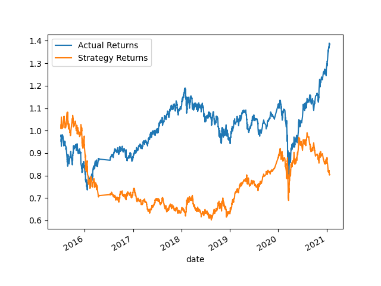
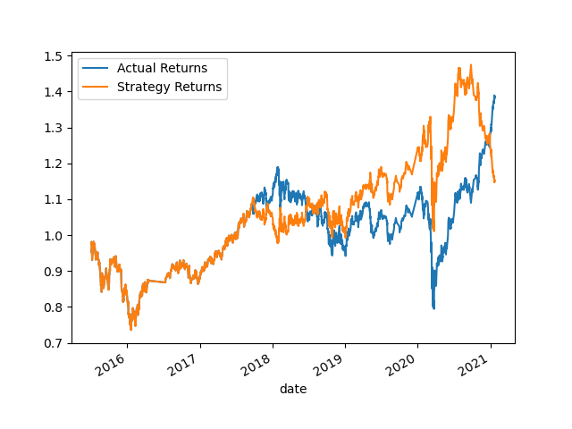

# Algo_Trading
Algo_Trading
## Conclusion

The original signal-driven strategy performed very poorly (down 30-40%). However, we saw improvement with the first learned strategy1 but still resulted in a cumulative approx. 20-30% loss.  
The second iteration of the strategy finally resulted in a gain of approx 10%, however, this underperorms relative to the actual return profile of the ETF itself. It looks like something  
changed at the end of 2020/2021 that caused the demise of our strategy and continued apprecaition of the ETF.

## Strategy1

## Strategy2

